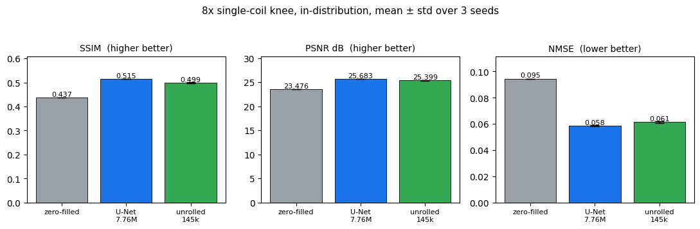

# physics-informed mri reconstruction

a controlled, reproducible study of undersampled mri reconstruction on the fastmri
single-coil knee benchmark. it puts a classical baseline, a u-net, and an unrolled
data-consistency network through one shared pipeline (same masks, metrics, volume
splits, and training recipe) with first-class quality control and honest, multi-seed
reporting.

**headline, and it is an honest negative result.** in a fully controlled,
in-distribution comparison at 8x acceleration, a well-trained u-net **outperforms**
the much smaller unrolled data-consistency network on every metric. the unrolled net
stays competitive at about **54x fewer parameters**, but it does not win at this
scale. three separate confounds that first suggested otherwise were found and
corrected along the way. the value here is the rigor and the reproducibility, not a
leaderboard number.

**the bridge from my background.** my physics-informed neural network work recovered
reliable signals from sparse, noisy measurements by building the governing physics
into the model instead of leaning on data alone. accelerated-mri reconstruction is
the same shape of problem: the data-consistency operator *is* the physics constraint,
it enforces the mr forward model (image <-> k-space via the fourier transform) at
every cascade. same idea, medical-imaging setting.

## limitations (read these first)

being upfront about scope is the point, not an afterthought.

* **single-coil, not clinical multi-coil.** real accelerated mri leans on parallel
  imaging across many receiver coils. 8x single-coil is a deliberately hard,
  ill-posed *benchmark*, not a viable clinical protocol. at that acceleration roughly
  7 of every 8 k-space lines are missing and there is no coil diversity, so the
  data-consistency operator is a weak constraint and the task collapses toward
  image-domain inpainting, where raw model capacity dominates.
* **a data subset.** trained on ~1,200 slices, bounded by free-colab iteration time
  (not gpu memory). both models are under-trained in absolute terms. the comparison
  is valid because it is *matched* (same data, loss, and schedule), not because the
  images are diagnostic.
* **reference metrics, not diagnostic validation.** ssim / psnr / nmse are
  reference-image proxies. none is a substitute for a radiologist read or a downstream
  clinical task, and no diagnostic-quality claim is made here. characterizing how
  reconstruction perturbs *downstream* features is the next project (see status).
* **a 2018-lineage architecture.** the unrolled dc-cnn is in the deep-cascade / modl
  family. modern state of the art (e2e-varnet, transformer/mamba cascades, diffusion
  priors) is multi-coil and far larger.

## the three methods (a controlled comparison)

| method | idea |
|--------|------|
| **zero-filled** | inverse-fft the undersampled k-space. aliased, no learning, the floor. |
| **u-net** | learn to de-alias in the image domain. a strong, high-capacity baseline (~7.76M params). |
| **unrolled dc-cnn** | alternate a learned cnn denoiser with a data-consistency layer that re-imposes the measured k-space, for several cascades (~145k params). the physics-informed model under test. |

the unrolled network is "physics-informed" because of the data-consistency layer:
wherever the scanner actually sampled k-space, the network is not allowed to overwrite
it. the cnn proposes, the physics disposes. the open question this project answers is
whether that inductive bias beats a generic high-capacity denoiser at this scale. the
answer, honestly measured, is no.

## results (real fastmri, honest)

**8x in-distribution, mean ± std over 3 seeds.** both the u-net and the unrolled net
are trained *and* evaluated at 8x with identical l1 loss, data, and schedule, so the
only thing that varies is the architecture.

| method | SSIM | PSNR (dB) | NMSE |
|---|---|---|---|
| zero-filled | 0.437 | 23.48 | 0.0945 |
| **u-net** (7.76M) | **0.515 ± 0.001** | **25.68 ± 0.03** | **0.0584 ± 0.0005** |
| unrolled dc-cnn (145k) | 0.499 ± 0.003 | 25.40 ± 0.07 | 0.0614 ± 0.0008 |

the u-net wins all three metrics. the ssim gap (about 0.016) is ~6x the seed-to-seed
spread, so it is robust rather than noise. at 4x the two land similarly close, within
the ~0.027 ssim run-to-run training variance measured across seeds. the small
physics-informed net comes within ~0.016 ssim of a model 54x its size but does not
surpass it, which is the expected result: at 8x single-coil the data-consistency
constraint is weak and parameter capacity wins. the unrolled nets that *do* beat
u-nets in the literature use multi-coil physics, weight sharing, and many more
cascades.



## the part worth your attention: how the number was earned

reaching that honest result meant catching three confounds, each of which would have
produced a false "the unrolled net wins":

1. **a scale bug, caught by qc.** real fastmri k-space is raw-scale (~1e-5). without
   per-slice normalization the unrolled net and the ssim loss went numerically
   unstable, and the per-sample qc range checks flagged it (hundreds of failures)
   before it could pass as a result.
2. **a training-acceleration and loss confound.** an early apparent win came from
   comparing an unrolled net trained at 8x (ssim loss) against a u-net trained at 4x
   (l1 loss). matching both made it vanish.
3. **an out-of-distribution baseline.** the unrolled net's apparent psnr / nmse edge
   at 8x came from a u-net evaluated outside its training acceleration. against an
   in-distribution u-net, that edge disappears too.

so the deliverable is a controlled, multi-seed, reproducible comparison that disproves
its own initial hypothesis. eval is bit-deterministic (verified by repeated runs);
training variance is characterized rather than ignored.

## the pipeline (this is a pipeline, not a notebook)

```
data loading -> undersampling -> reconstruction -> qc -> evaluation -> visualization
   (synthetic     (configurable    (zero-filled /   (input &   (ssim/psnr/   (panels +
    or fastmri)    R = 4x, 8x)      u-net /         output      nmse per      metric
                                    unrolled)        checks)     acceleration) plots)
```

* **config-driven and seed-controlled.** every run is `(yaml + cli overrides + fixed
  seed)`, so results reproduce. see `configs/`.
* **quality control is first-class** (`src/mri_recon/qc.py`): finite / shape / empty
  checks, a k-space-centering check that catches the classic forgotten-`fftshift`
  bug, and metric range checks. every dropped sample is logged with a reason. this is
  what caught confound #1.
* **one forward pass, shared by train and eval** (`reconstruct_batch`), so what gets
  trained is exactly what gets scored.
* **containerized**, a pinned cpu `Dockerfile`, one-command runs via `run.ps1` /
  `Makefile`.

## quickstart

```bash
# 0. core physics sanity check, numpy only, no torch, no download, ~2s
python scripts/smoke_test.py

# 1. install (python 3.10 / 3.11 recommended)
pip install -r requirements.txt && pip install -e .

# 2. full pipeline on synthetic data, no download, runs on cpu in minutes
python -m mri_recon.cli train --config configs/synthetic.yaml
python -m mri_recon.cli eval  --config configs/eval.yaml
python -m mri_recon.cli figures --config configs/eval.yaml

# 3. the controlled fastmri comparison (download ONLY knee_singlecoil_val ~15 GB,
#    extract, split by volume; see scripts/download_fastmri.md). both models use the
#    SAME l1 loss and the SAME acceleration, so only the architecture differs.
python -m mri_recon.cli train --config configs/fastmri_knee_split.yaml \
  --set 'mask.accelerations=[8]' 'mask.center_fractions=[0.04]' output.dir=results/unet_8x
python -m mri_recon.cli train --config configs/fastmri_knee_split.yaml \
  --set model.name=unrolled train.batch_size=1 \
        'mask.accelerations=[8]' 'mask.center_fractions=[0.04]' output.dir=results/unrolled_8x
python -m mri_recon.cli eval --config configs/fastmri_knee_split.yaml \
  --set 'eval.methods=[zero_filled,unet,unrolled]' \
        'eval.accelerations=[8]' 'eval.center_fractions=[0.04]' \
        eval.checkpoints.unet=results/unet_8x/best.pt \
        eval.checkpoints.unrolled=results/unrolled_8x/best.pt
```

windows: `.\run.ps1 train --config configs\synthetic.yaml`.
docker: `docker build -t mri-recon . && docker run --rm mri-recon smoke`.
colab: open [`notebooks/colab_mri_reconstruction.ipynb`](notebooks/colab_mri_reconstruction.ipynb).
**use a gpu runtime (t4 / l4 / a100), not tpu** (the complex fft is not xla-friendly).
the unrolled net trains at `batch_size=1` because real single-coil k-space is
variable-width and cannot be stacked; the u-net batches normally and uses bf16 mixed
precision on ampere+ gpus.

## design decisions (be ready to defend each)

* **centered orthonormal fft** matching fastmri, so dc energy sits at the array centre
  and "keep the central lines" is meaningful. unit-tested for round-trip identity.
* **per-slice scale normalization.** real k-space is raw-scale; normalizing each slice
  to O(1) is scale-invariant for the metrics (ssim / psnr use a data range, nmse is a
  ratio) but is what makes the unrolled net and ssim loss numerically stable.
* **matched loss for the architecture comparison.** the headline comparison trains
  both models with l1 so the only variable is the architecture. loss was *itself*
  treated as a variable: one of the corrected confounds was an unrolled net trained on
  ssim vs a u-net trained on l1.
* **hard vs soft data consistency.** hard dc trusts the measurement exactly, soft dc
  blends `k = (k_pred + lam*k_meas)/(1+lam)` with a learnable lam (schlemper). we
  parameterize `v = sigmoid(theta)` and learn theta, starting near hard dc.
* **residual cnn denoiser**, predicts a correction rather than the image, which trains
  more stably across a deep cascade.
* **the numpy reference is the test.** `mri_recon.fft.data_consistency_np` and the
  torch `DataConsistency` layer implement the same arithmetic; the numpy version is
  asserted correct in `scripts/smoke_test.py` and `tests/`, which is what gives
  confidence in the differentiable version.

## repo layout

```
src/mri_recon/
├── fft.py              # centered fft + numpy data-consistency reference
├── masking.py          # cartesian undersampling masks (random / equispaced)
├── metrics.py          # ssim / psnr / nmse (skimage or numpy fallback)
├── qc.py               # quality-control checks + report
├── data/
│   ├── synthetic.py    # phantom generator (no download)
│   ├── fastmri_dataset.py  # real .h5 loader + shared transform + per-slice scaling
│   ├── splits.py       # volume-level train/val/test split (no slice leakage)
│   └── transforms.py
├── models/
│   ├── zero_filled.py  # baseline (numpy)
│   ├── unet.py         # image-domain denoiser
│   ├── unrolled.py     # the cascade (physics-informed model under test)
│   └── layers.py       # torch fft, DataConsistency, ConvBlock, SSIMLoss
├── train.py  evaluate.py  viz.py  utils.py  cli.py
scripts/   smoke_test.py · baseline_table.py · download_fastmri.md
configs/   default · synthetic · unet_4x · unrolled_8x · eval · fastmri_knee_split
tests/     test_core.py
```

## status

pipeline verified end-to-end (physics core unit-tested) and run on real fastmri
single-coil knee. the controlled, multi-seed comparison above is the current result:
**a well-trained u-net beats the small unrolled net at 8x single-coil, and the
project documents the rigorous path (qc, confound isolation, variance
characterization) used to establish that honestly.**

next: a downstream **radiomic-feature-stability** analysis, measuring how each
reconstruction perturbs quantitative imaging biomarkers (icc / ccc of pyradiomics
features against the fully-sampled reference), which reframes "reconstruction quality"
in the terms that actually matter for quantitative imaging.
